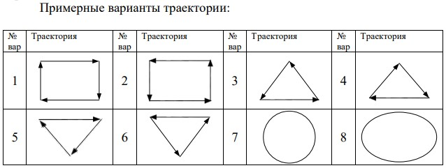

Лабораторная работа 1. Отладка программы на примере элементарного 
Windows-приложения
Цель работы: освоить основные приемы отладки программы на 
примере элементарного Windows-приложения.
Задание: реализовать циклическое движение объекта по поверхности 
формы по траектории, заданной преподавателем. При этом должна быть 
возможность остановки/возобновления движения пользователем. Для 
контроля правильности процесса используется программа-отладчик –
владение процессом отладки студент должен продемонстрировать 
преподавателю.
